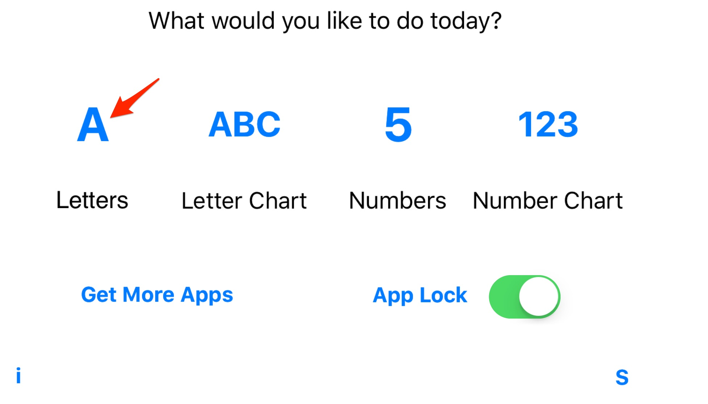
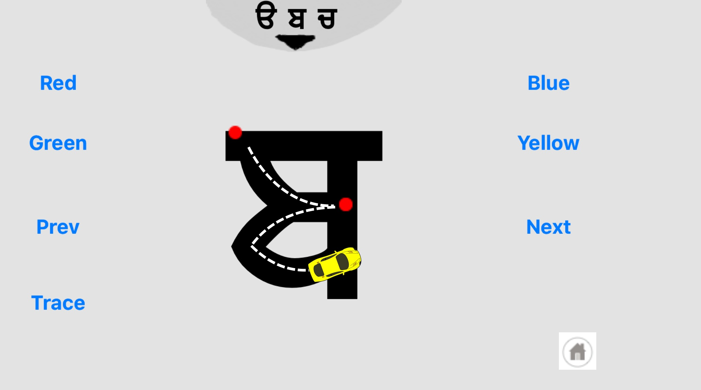
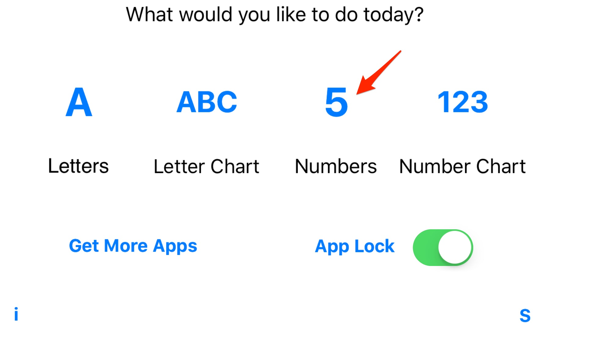
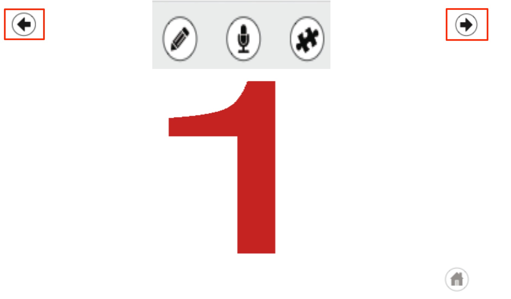
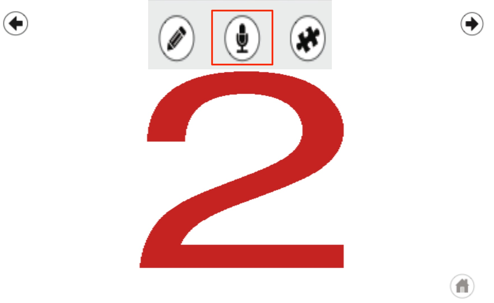
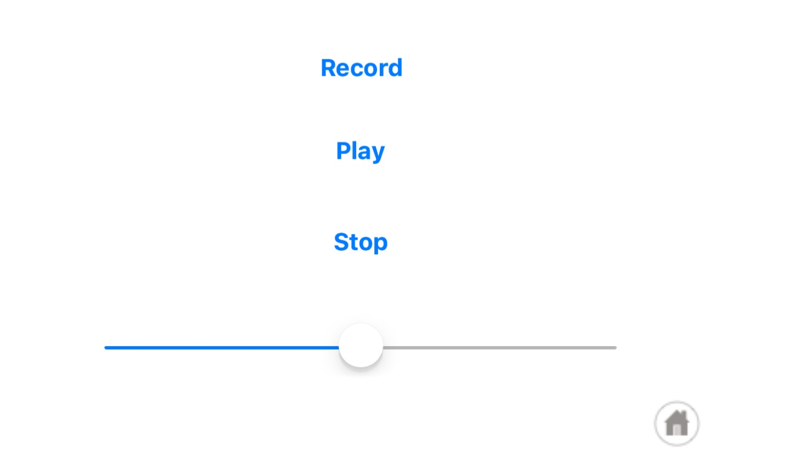
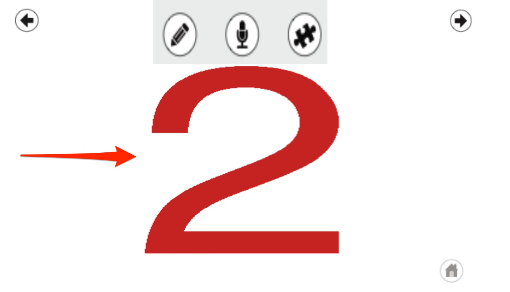
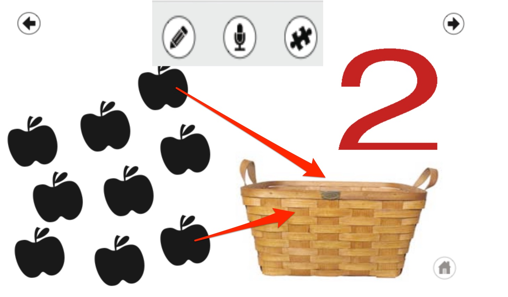

# FlashCards

Sample Objective C application for testing out various ios features

## Load Application 

- Start the Application by touching on the **Blocks**

    

## Car Trace

- Touch the letter **A** to enter the **Car Trace** window

    

### Car Trace Options

- Change car colors by touching **Red, Green, Blue or Yellow**
- Touch the car to cause it to move, then follow along its path with your finger.
- Touch **Trace** to cause the car to follow the entire path of the letter.
- Touch **Next or Prev** to go to the next or previous letter.
- Touch the Home icon to return to the main menu

    

## Number Game

- Touch the number **5** to go to the Number Game

    

### Number Game Options

- Turn your speakers on, and Touch the **right and left arrows** to navigate to the different numbers

    

- Touch on the **microphone** icon to record your voice

    

- Touch the **Record** text, then say something... Then touch the **Stop** text to end your recording. Then touch the **Play** text to play back your recording. 
- Touch the **Home** icon to return to the Number Game. 

    

- **Swipe** your finger to the **Right** to load the **Apple Basket Game**

    

### Apple Basket Game

- When the Apple Basket is displayed, **drag and drop** the apples into the basket. The **basket** will **spin** when the correct number of apples are place in the basket. 

    

